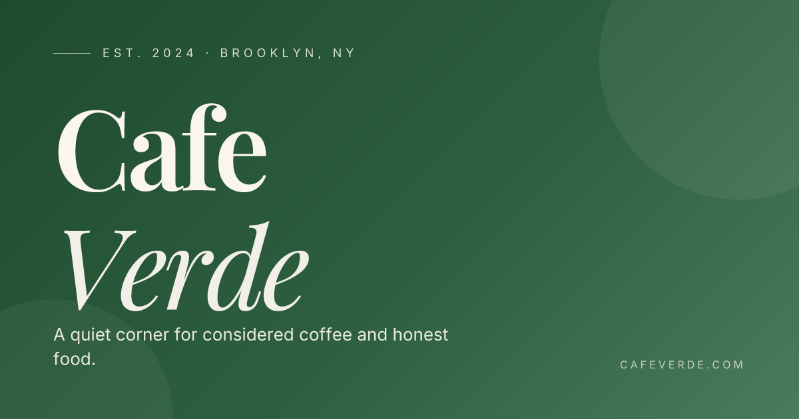

# Cafe Verde

> A full-stack restaurant ordering site, built as a portfolio piece.
> Next.js 14 · TypeScript · Tailwind · Supabase · Framer Motion.

**Live demo:** https://cafe-verde-six.vercel.app



---

## Overview

Cafe Verde is a fully working restaurant ordering site — a public storefront, a customer account area, and a SaaS-style admin dashboard, all wired to a real Postgres database with row-level security and realtime subscriptions.

Built to demonstrate the kind of polish a paying client should expect: considered typography, an editorial visual language, micro-interactions, accessible markup, and an admin UI that an actual cafe owner could use.

### Highlights

- **Three apps in one repo** — storefront, customer account, admin dashboard
- **Real database, real auth** — Supabase Postgres with RLS, email-OTP auth, customer accounts, saved addresses
- **Live order tracking** — Supabase Realtime pushes status changes to the customer's tracking page without a refresh
- **Tamper-proof checkout** — server action re-fetches live prices and rejects mismatches before saving the order
- **Admin dashboard** — sidebar nav, stat cards (today's orders, revenue, pending, average ticket), expandable orders table with status pills, polished menu manager with category filters and live availability toggles
- **Production-ready meta** — generated OG image, generated favicon + apple-touch-icon, robots.txt, sitemap.xml, per-page titles

---

## Screenshots

| | |
| :---: | :---: |
|  |  |
| **Home** — editorial hero, scroll-fade sections, premium cards | **Menu** — category scroll-spy, hover-lift product cards |
|  |  |
| **Checkout** — single-page collapsing flow (Contact → Delivery → When → Pay → Review) | **Order tracking** — Supabase Realtime, no refresh |
|  |  |
| **Admin · Orders** — stat cards + expandable order rows | **Admin · Menu** — filters, availability toggles, edit dialog |

> Screenshots live in `docs/screenshots/`. To capture fresh ones, run the app and use your browser or a tool like [Playwright](https://playwright.dev/) to take 1440×900 PNGs of `/`, `/menu`, `/checkout`, `/account/orders/[id]`, `/admin`, `/admin/menu`.

---

## Stack

| Layer | Choice |
| --- | --- |
| Framework | Next.js 14 (App Router, RSC, Server Actions) |
| Language | TypeScript (strict) |
| Styling | Tailwind CSS + custom design tokens |
| Animation | Framer Motion |
| UI primitives | Radix UI (shadcn-style) |
| Database | Supabase Postgres + RLS |
| Auth | Supabase email OTP + magic link |
| Realtime | Supabase `postgres_changes` |
| Cart state | Zustand (with `persist` + hydration gate) |
| Forms | react-hook-form + Zod |
| Icons | Lucide |
| Toasts | Sonner |

### Design system

- **Palette** — Forest `#2D5F3F` · Cream `#FAF6EE` · Charcoal `#1A1A1A` (admin uses cooler slate neutrals for SaaS feel)
- **Type** — Playfair Display (serif, editorial), Inter (sans, UI), tight `-0.04em` tracking on serif
- **Motion** — soft cubic-bezier `[0.2, 0.7, 0.2, 1]`, slow image zooms (1.4s), scroll-triggered fade-ins, respects `prefers-reduced-motion`

---

## Routes

### Public

| Path | What |
| --- | --- |
| `/` | Home — full-bleed hero, featured items, story, location |
| `/menu` | Full menu, scroll-spy category nav, add to cart |
| `/checkout` | Collapsing single-page checkout (Contact → Delivery → When → Pay → Review) |
| `/order-confirmed` | Thank-you screen with order reference + signup nudge for guests |
| `/login` · `/signup` | Email OTP sign-in / sign-up |

### Customer (auth required)

| Path | What |
| --- | --- |
| `/account` | Overview — recent order, stats |
| `/account/orders` | Past orders list |
| `/account/orders/[id]` | **Live tracking page** (Supabase Realtime) |
| `/account/addresses` | Saved addresses CRUD |

### Admin (password gate)

| Path | What |
| --- | --- |
| `/admin/login` | Single-password sign-in |
| `/admin` | Dashboard — stat cards + live orders table |
| `/admin/menu` | Add / edit / delete / toggle availability |

When you change an order status in `/admin`, the customer's tracking page updates in real time — no refresh.

---

## Architecture notes

- **Auth, customer side** — Supabase email OTP. Magic link in the email goes to `/auth/callback` which exchanges the code for a session; alternatively the user can paste the 6-digit code from the same email.
- **Auth, admin side** — single password (`ADMIN_PASSWORD`) and a signed cookie (HMAC-SHA256 via Web Crypto, so it works on Edge runtime). For a real client, swap this for Supabase Auth + a role check.
- **Tamper-proof orders** — the `placeOrder` server action re-fetches live prices from the DB and rejects the order if the client cart's prices don't match.
- **Address as snapshot** — saved addresses (`addresses` table) and the address on an order (`orders.address` JSONB) are independent. Editing a saved address doesn't mutate past receipts.
- **RLS** — anyone (including guests) can `INSERT` orders. Customers can only `SELECT` their own. Admin uses the service-role key, bypassing RLS.
- **Realtime** — `orders` is in the `supabase_realtime` publication. The customer's tracking page subscribes to `UPDATE` on their own row.
- **Hydration safety** — Zustand cart values are gated behind a `mounted` flag to avoid the persist/SSR mismatch.
- **Generated assets** — favicon (`app/icon.tsx`), apple-touch icon (`app/apple-icon.tsx`), and Open Graph image (`app/opengraph-image.tsx`) are all rendered programmatically via `next/og` — no PNG assets to ship or keep in sync.

---

## Run locally

### 1. Install

```powershell
cd cafe-verde
npm install
```

### 2. Set up Supabase

Create a free project at <https://supabase.com>, then in **SQL Editor** run, in order:

- `supabase/migrations/0001_init.sql`
- `supabase/migrations/0002_auth_addresses.sql`
- `supabase/seed.sql`

#### Auth — email OTP (works out of the box)

Customer sign-in uses Supabase's built-in email (no external SMS provider, no extra config). The free tier is rate-limited (~3-4 emails/hour) but plenty for portfolio demos. For higher volume, add a custom SMTP under **Authentication → Settings → SMTP**.

The user enters their email → gets a magic link + 6-digit code → either clicks the link or pastes the code → signed in.

### 3. Configure env

```powershell
copy .env.local.example .env.local
```

Fill in:

```env
NEXT_PUBLIC_SUPABASE_URL=...
NEXT_PUBLIC_SUPABASE_ANON_KEY=...
SUPABASE_SERVICE_ROLE_KEY=...           # Dashboard → Settings → API → Secret keys
ADMIN_PASSWORD=...                       # any strong password
ADMIN_COOKIE_SECRET=...                  # any long random string (32+ chars)
NEXT_PUBLIC_SITE_URL=http://localhost:3001  # production URL once deployed
```

### 4. Run

```powershell
npm run dev
```

Open <http://localhost:3001>.

---

## Promo codes (demo)

UI-only, hardcoded in [`lib/promo.ts`](lib/promo.ts):

- `VERDE10` — 10% off subtotal
- `WELCOME` — 15% off subtotal

---

## Deploy

1. Push to GitHub.
2. Go to <https://vercel.com/new> → import the repo.
3. Copy env vars from `.env.local` into **Vercel → Settings → Environment Variables**. Set `NEXT_PUBLIC_SITE_URL` to your production URL (e.g. `https://cafe-verde.vercel.app`) so OG metadata, robots.txt, and sitemap pick up the right hostname.
4. Deploy.

After deploy, replace the **Live demo** line at the top of this README with your URL.

---

## Project structure

```
cafe-verde/
├─ app/
│  ├─ layout.tsx              # root metadata, fonts, Toaster
│  ├─ icon.tsx                # programmatic favicon (32×32)
│  ├─ apple-icon.tsx          # programmatic apple-touch-icon (180×180)
│  ├─ opengraph-image.tsx     # programmatic OG image (1200×630)
│  ├─ robots.ts · sitemap.ts  # SEO
│  ├─ page.tsx                # home
│  ├─ menu/                   # menu
│  ├─ checkout/               # checkout
│  ├─ login/ · signup/        # email OTP auth
│  ├─ auth/callback/          # magic-link exchange route
│  ├─ account/                # customer area (auth required)
│  └─ admin/(protected)/      # admin dashboard (password gate)
├─ components/
│  ├─ home/                   # hero, featured, about, location
│  ├─ menu/                   # category nav, item cards
│  ├─ checkout/               # 5-section collapsing flow
│  ├─ account/                # order tracker (Realtime)
│  ├─ admin/                  # sidebar, stat cards, orders table, menu editor
│  ├─ auth/                   # email OTP form
│  ├─ layout/                 # header, footer
│  ├─ icons/                  # brand SVG glyphs
│  └─ ui/                     # shadcn-style primitives + Reveal
├─ actions/                   # server actions (place-order, menu CRUD, status)
├─ lib/                       # supabase clients, types, format, promo, cart store, auth
├─ supabase/                  # migrations + seed
└─ middleware.ts              # admin cookie + Supabase session refresh
```

---

## License

MIT. Built by Ahmad as a portfolio piece — feel free to fork or steal.
